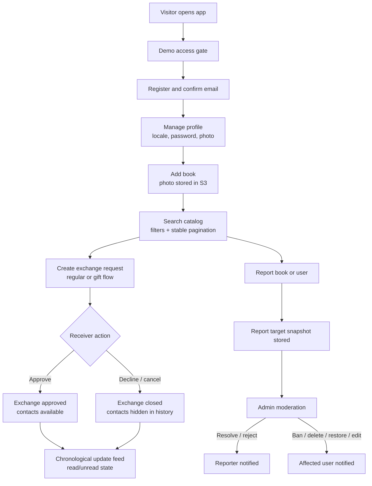
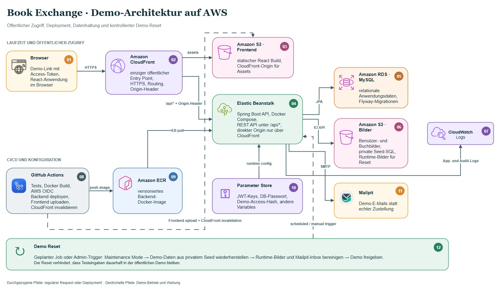

_For German demo guidance and details about the in-app video walkthrough, see [Demo Guide DE](docs/demo-guide.de.md). The repository README stays in English for engineering review, while the demo guide and walkthrough are in German for German-speaking reviewers._

# Book Exchange Backend

Backend for a full-stack book exchange platform where users publish books, request exchanges, receive notifications, report problematic content, and moderators manage the platform through an admin API.

This repository is intentionally built as a portfolio-grade Spring Boot project rather than a minimal CRUD demo. It includes authentication, moderation workflows, transactional notifications, S3 image storage, optional Elasticsearch search, demo-environment safeguards, Docker-based local development, AWS deployment preparation, and a broad automated test suite.

## Highlights

- **Product-like backend scope**: authentication, catalog, exchanges, reports, admin moderation, notifications, demo reset, metadata, and public API documentation.
- **Frontend-friendly API contracts**: metadata endpoints expose enums, categories, locales, sort fields, feature flags, public links, and demo account data so the React app does not duplicate backend constants.
- **Safe write flows**: mutable resources use optimistic locking with `ETag` / `If-Match`.
- **Moderation with history**: reports store immutable target snapshots, so report history remains understandable even when a book/user is later changed or deleted.
- **Transaction-aware side effects**: email notifications are dispatched only after transaction commit.
- **Resilient search**: Elasticsearch improves book discovery when enabled; the API falls back to JPA search if search infrastructure is unavailable.
- **AWS-ready demo setup**: CloudFront, Elastic Beanstalk, ECR, RDS, S3, Parameter Store, CloudWatch logs, and GitHub Actions deployment are accounted for.
- **Demo safety**: demo access gate, CloudFront origin verification, demo reset, Mailpit-based email sandbox, and warning/consent flow for public demo users.

## Live Demo Model

The demo environment is designed to be public enough for a portfolio review, but not treated as a production service.

- The public entrypoint is a CloudFront URL.
- The frontend accepts a temporary `access` query parameter from the shared portfolio link and exchanges it for a demo access cookie.
- The direct Elastic Beanstalk origin is protected by a CloudFront-only verification header.
- Demo users are available through the frontend login helper. Their credentials are intentionally demo-only and are configured through environment variables, not hardcoded in the repository.
- Admin credentials are not published. After the first successful demo access, an in-app German video walkthrough opens in a modal and demonstrates the core user and admin flows; deeper admin scenarios can be shown live when needed.
- The demo reset job can restore the environment from a seed SQL stored privately in S3 and clean runtime photos / Mailpit messages.

Typical demo access flow:

```text
CloudFront URL with ?access=... -> frontend stores demo access -> backend issues HttpOnly demo cookie -> app is usable
```

The access token itself is not stored in this repository. The backend stores only a SHA-256 hash through `APP_DEMO_ACCESS_TOKEN_HASH`.


## Core Business Flow



## Main API Areas

All endpoints are versioned under:

```text
/api/v1
```

Main areas:

- **Auth**: registration, email confirmation, login, refresh token, logout, forgot password, reset password, account deletion request.
- **Users**: profile, locale, password, profile photo, account deletion.
- **Books**: user book CRUD, public catalog search, public book details, photo deletion, optimistic locking.
- **Exchanges**: requests, offers, gift flow where `senderBookId` can be `null`, status transitions, details, history.
- **Updates**: dedicated chronological feed for exchange and account notifications, with read/unread filters and manual read-state actions.
- **Reports**: report book/user, report history, target snapshots.
- **Admin**: users, books, exchanges, reports, role changes, demo reset.
- **Metadata**: frontend options such as locales, book categories, statuses, roles, sort fields, public links, feature flags, and demo account data.
- **Demo email sandbox**: frontend-facing inbox API backed by Mailpit for demo-only email visibility.

Swagger is available locally at:

```text
http://localhost:8080/api/v1/swagger-ui/index.html
```

In the demo environment, Swagger is intentionally enabled so the API contract can be inspected together with the running app. Access is still behind the demo gate.

## Security Decisions

- **JWT authentication** for authenticated API endpoints.
- **Role-based admin access** with `ADMIN` and `SUPER_ADMIN` responsibilities separated.
- **Demo access gate** for public demo traffic. A shared access token is accepted once and converted into an HttpOnly cookie.
- **CloudFront origin verification** blocks direct access to the Elastic Beanstalk origin for normal API traffic.
- **CORS is environment-driven** and should point to the CloudFront frontend URL in demo.
- **Rate limiting** protects login, email-triggering endpoints, Swagger/API docs, demo access verification, and sensitive public actions.
- **No account enumeration** for public email actions such as forgot password, resend confirmation, and account deletion request.
- **Optimistic locking** uses `ETag` / `If-Match` on mutable resources.
- **Actuator is minimal**: only health is exposed.
- **Secrets are externalized** through environment variables / SSM Parameter Store, not committed to Git.
- **S3 access is scoped by prefix**: public reads are limited to image prefixes; demo seed SQL stays private.

Direct origin protection is enabled by:

```text
APP_DEMO_ORIGIN_GUARD_ENABLED=true
APP_DEMO_ORIGIN_GUARD_HEADER_NAME=X-Origin-Verify
APP_DEMO_ORIGIN_GUARD_HEADER_VALUE=<same secret configured as CloudFront origin custom header>
```

Expected checks:

```bash
curl -i http://book-exchange.eu-central-1.elasticbeanstalk.com/api/v1/metadata
# 403 when origin guard is enabled

curl -i https://<cloudfront-domain>/api/v1/metadata
# reaches backend through CloudFront
```

## AWS Demo Infrastructure

The current deployment approach is intentionally pragmatic: strong enough to demonstrate AWS knowledge, but not overbuilt for a low-traffic portfolio project.

The following detailed deployment view is in German and is intended for explaining the running demo to the project's primary target audience.



AWS components:

- **CloudFront**: one public domain for frontend and `/api/*`.
- **S3 frontend bucket**: hosts the React build.
- **Elastic Beanstalk**: runs backend Docker Compose with the backend container and Mailpit.
- **ECR**: stores immutable backend images tagged by commit SHA.
- **RDS MySQL**: persistent relational database.
- **S3 image bucket**: stores profile/book photos and private demo seed SQL.
- **SSM Parameter Store**: stores secrets such as JWT key, DB password, demo access hash, and origin header secret.
- **CloudWatch Logs**: application logs, audit logs, deployment/runtime diagnostics.
- **GitHub Actions OIDC**: deploys without long-lived AWS access keys.

Important demo environment variables are documented in:

```text
.env.demo.example
```

## Demo Reset

The demo environment can be reset to a known state.

Reset flow:

1. Enable maintenance mode.
2. Clear mutable runtime data.
3. Import private demo seed SQL from S3.
4. Delete runtime S3 objects under the configured prefix.
5. Clear Mailpit/demo inbox state.
6. Reindex search if search is enabled.
7. Disable maintenance mode.

Manual admin endpoint:

```text
POST /api/v1/admin/demo/reset
```

Seed SQL is intentionally not committed to the public repository. It should live in a private S3 object such as:

```text
s3://<image-bucket>/private/demo-reset/demo-seed-export.sql
```

## Email Strategy

Local and demo email is captured by Mailpit instead of sending real emails to external recipients.

- Local Mailpit UI:

```text
http://localhost:8025
```

- Demo frontend uses backend email sandbox APIs so a reviewer can see emails belonging to the active demo session/account without opening a global Mailpit inbox.
- Notification templates are Thymeleaf-based and localized.
- Emails are dispatched after transaction commit.
- A small delay can be configured when sending notifications to multiple users to avoid provider rate limits.

For a real production setup, the same SMTP abstraction can point to SES or another provider.

## Search

Book search supports two modes:

- **Elasticsearch enabled**: ngram-based text search for better discovery.
- **Elasticsearch disabled/unavailable**: JPA fallback keeps the public catalog usable.

This is useful in demo deployments where running Elasticsearch may not be worth the cost. The demo profile can disable Elasticsearch autoconfiguration while local development still runs Elasticsearch through Docker Compose.

## Image Storage

The API accepts Base64 images from the frontend, resizes them, stores objects in S3, and persists only `photoUrl` in MySQL.

Object layout:

```text
users/{userId}/profile_photo_{timestamp}.ext
users/{userId}/books/{bookId}_{timestamp}.ext
```

Replacing a photo removes the previous object for the same logical target. Account/book cleanup removes related runtime objects according to retention/reset policies.

## Local Development

### Prerequisites

- Java 25
- Docker Desktop
- Git
- PowerShell on Windows

### Environment

Create `.env` from the example:

```powershell
Copy-Item .env.example .env
```

At minimum, configure local DB credentials and a sufficiently long JWT secret:

```text
DB_NAME=...
DB_USERNAME=...
DB_PASSWORD=...
DB_ROOT_PASSWORD=...
APP_JWT_SECRET_KEY=...
```

### Full Stack With Docker Compose

Expected folder layout:

```text
workspace/
  book-exchange/
  book-exchange-frontend/
```

Run backend, frontend, MySQL, Mailpit, and Elasticsearch:

```powershell
docker compose -f .\docker-compose.local.yml up --build --watch
```

Useful local URLs:

```text
Frontend:        http://localhost:5173
Backend API:     http://localhost:8080/api/v1
Swagger:         http://localhost:8080/api/v1/swagger-ui/index.html
Mailpit:         http://localhost:8025
Actuator health: http://localhost:8081/actuator/health
Elasticsearch:   http://localhost:9200
```

Frontend source files are bind-mounted into the container. Vite HMR updates JS/JSX/CSS without rebuilding the image. Backend Compose Watch rebuilds the backend container after backend source, Maven, Dockerfile, or `.env` changes.

If only infrastructure is needed and the backend is started from the IDE:

```powershell
docker compose -f .\docker-compose.infra.yml up -d
```

Then run Spring Boot with profile:

```text
local
```

Convenience scripts:

```powershell
.\run-local.ps1
.\reload-backend-config.ps1
```

## Tests

Run the full suite:

```powershell
.\run-tests.ps1
```

The test setup uses JUnit, Mockito, MockMvc, Spring integration tests, and MySQL Testcontainers.

Expected scale:

```text
Unit tests       : ~255+
Integration tests: ~180+
Total tests      : ~435+
```

Direct Maven command:

```bash
./mvnw -B verify
```

Coverage report:

```text
target/site/jacoco/index.html
```

## CI/CD

Backend workflow:

```text
.github/workflows/backend-ci.yml
```

Pipeline:

1. Set up Java 25.
2. Run `./mvnw -B verify`.
3. Print unit/integration test summary.
4. Build backend Docker image.
5. On `main` / manual dispatch, push image to ECR.
6. Render `docker-compose.eb.template.yml` with the immutable ECR image URI.
7. Upload Elastic Beanstalk source bundle.
8. Deploy the EB environment.

The frontend lives in a separate repository and is deployed independently:

1. `npm ci`
2. `npm run build`
3. Upload `dist` to S3.
4. Invalidate CloudFront.

This split keeps backend and frontend reviews independent while still supporting a full local stack through Docker Compose.

## Configuration Files

- `.env.example`: local development values.
- `.env.demo.example`: reference values for Elastic Beanstalk / demo environment.
- `docker-compose.local.yml`: local full-stack development.
- `docker-compose.infra.yml`: local infrastructure only.
- `docker-compose.eb.template.yml`: CI-rendered Elastic Beanstalk deployment template.
- `application-*.properties`: Spring profiles.

## Roles

- `USER`: regular user, manages profile/books/exchanges/reports.
- `ADMIN`: moderation access for users, books, exchanges, and reports.
- `SUPER_ADMIN`: can grant/revoke admin rights.

There is no public endpoint for creating a super admin. It is expected to be provisioned as a bootstrap account for the demo/operations environment.

Admin capabilities:

- Search active/deleted/banned users.
- Ban/unban users.
- Soft-delete/anonymize accounts.
- Inspect, edit, delete, restore books.
- Delete book photos.
- Inspect exchanges for moderation context.
- Resolve/reject reports with historical snapshots.
- Trigger manual demo reset.
- Grant/revoke admin rights when acting as super admin.

## Repository Layout

```text
src/main/java/com/example/bookexchange
  admin/          admin APIs and moderation services
  auth/           registration, login, refresh tokens, verification tokens
  book/           book catalog, CRUD, image handling, search indexing
  common/         audit, config, email, S3 storage, jobs, metadata, demo tooling, web responses
  exchange/       requests, offers, gift flow, and exchange history
  report/         user reports and immutable target snapshots
  security/       JWT, filters, rate limiting, role/security config
  updates/        dedicated chronological update feed API and read-state actions
  user/           profile, password, account deletion, locale

src/main/resources
  db/migration/   Flyway migrations
  templates/      Thymeleaf email templates
  messages*.properties localized validation, errors, categories, cities, and email copy
```

## Engineering Highlights

The project deliberately connects product requirements with explicit backend and infrastructure decisions:

- **Consistency**: optimistic locking prevents stale frontend writes.
- **Moderation**: report snapshots preserve historical context without keeping deleted profiles “alive”.
- **Security**: demo access, origin guard, JWT auth, role separation, rate limits, CORS, and minimal actuator exposure.
- **Infrastructure**: CloudFront + S3 frontend, Elastic Beanstalk Docker backend, ECR, RDS, S3 image storage, CloudWatch logs, GitHub OIDC deployment.
- **Reliability**: after-commit email dispatch and JPA fallback when Elasticsearch is unavailable.
- **Frontend contract quality**: metadata endpoints avoid duplicated enums and feature flags.
- **Testing**: integration coverage uses real MySQL through Testcontainers instead of relying only on H2/mocks.
- **Demo hygiene**: reset job, private seed SQL, Mailpit inbox isolation, and explicit demo data policy.

The system is intentionally scoped for a portfolio/demo environment, but most design decisions map directly to production-grade concerns: explicit boundaries, externalized configuration, auditable moderation, safe side effects, and observable runtime behavior.
